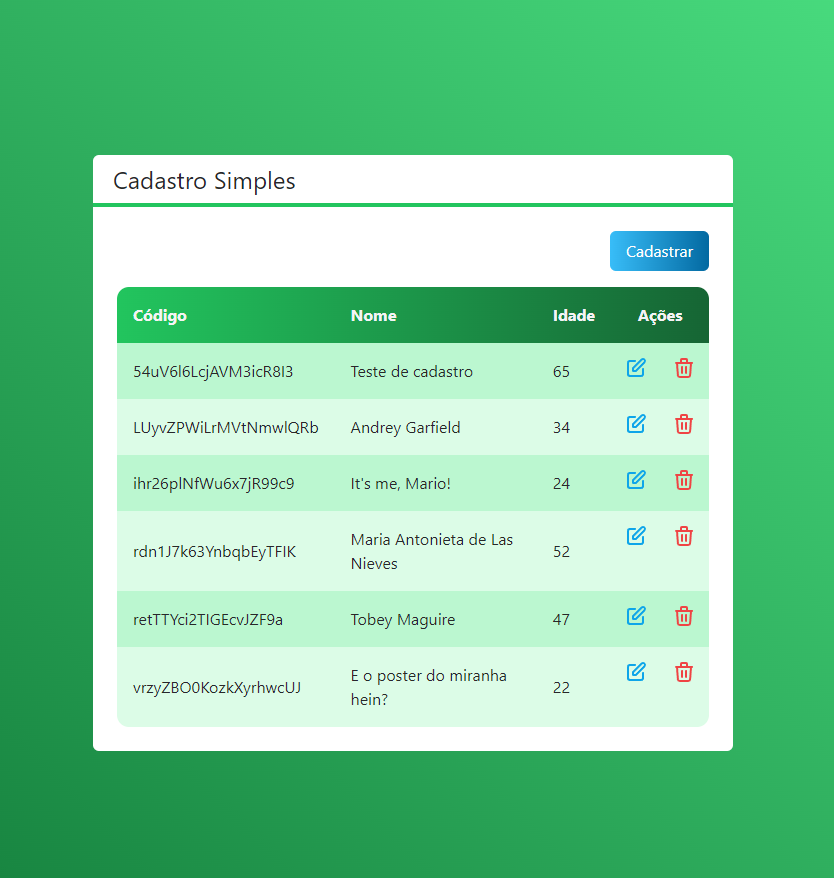

<h3 align="center">Cadastro Simples - CRUD NEXTJS</h3>

<p align="center">"A persistência é o caminho do êxito."</p>

<p align="center">
  <a href="#about">Sobre</a>&nbsp;&nbsp;&nbsp;|&nbsp;&nbsp;&nbsp;
  <a href="#technologies">Tecnologias</a>&nbsp;&nbsp;&nbsp;|&nbsp;&nbsp;&nbsp;
  <a href="#requires">Requisitos</a>&nbsp;&nbsp;&nbsp;|&nbsp;&nbsp;&nbsp;
  <a href="#install">Instalação</a>&nbsp;&nbsp;&nbsp;|&nbsp;&nbsp;&nbsp;
</p>

## :speech_balloon: Sobre <a name="about"></a>

> Este projeto é um simples CRUD apenas para praticar NextJS

<br>

## :heavy_check_mark: Tecnologias <a name="technologies"></a>

- [NextJS](https://nextjs.org/docs)
- [Firebase](https://www.npmjs.com/package/firebase)
- [Tailwindcss](https://tailwindcss.com/docs/guides/nextjs)
- [Typescript](https://www.typescriptlang.org/docs/)

<br />
<table>
  <tr>
    <td colspan="1">Visualização</td>
  </tr>
  <tr>
    <td></td></td>
  </tr>
</table>

## :warning: Requisitos <a name="requires"></a>

* [node V14.16](https://nodejs.org/pt-br/download/)
* [npm v6.14](https://www.npmjs.com/package/download)


## :warning: Instalação <a name="install"></a>

```bash
# Instalar todas as dependências necessárias:
$ npm install     

# Iniciar o projeto:
> $ npm run dev

```

# Por enquanto é só! Obrigado ;)
<br>
<a href="https://github.com/WendelNogueira23">
<p align="center">Wendel Nogueira</p>
</a>
